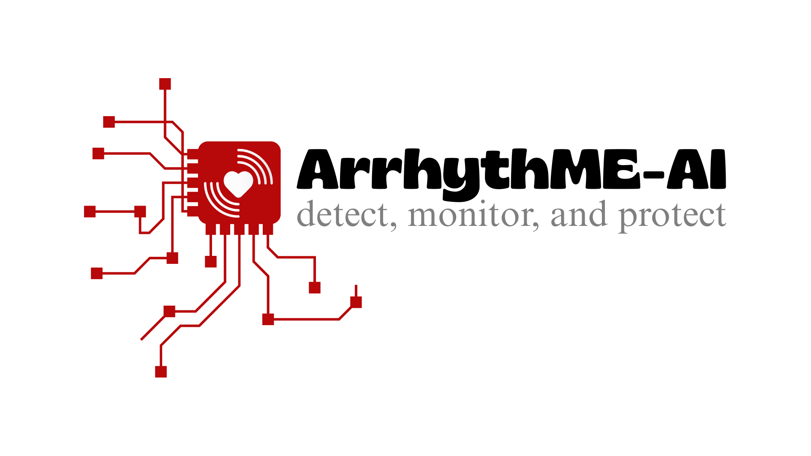

<html class="scroll-smooth" lang="en">
 <head>
  <meta charset="utf-8"/>
  <meta content="width=device-width, initial-scale=1" name="viewport"/>
  <title>
   ArrhythME-AI - Deteksi Aritmia
  </title>
  
  <link href="https://cdnjs.cloudflare.com/ajax/libs/font-awesome/5.15.3/css/all.min.css" rel="stylesheet"/>
  <link href="https://fonts.googleapis.com/css2?family=Poppins:wght@400;600&amp;display=swap" rel="stylesheet"/>
  
 </head>
 <body class="min-h-screen flex flex-col bg-white bg-opacity-90 backdrop-blur-sm">
  <!-- Container -->
  

   <!-- Logo and Header -->
   <header class="flex items-center justify-between mb-8 border-b border-red-300 pb-4" role="banner">
    

     
     <h1 class="text-3xl font-extrabold text-red-700 select-none">
      ArrhythME-AI
     </h1>
    

    <nav aria-label="Primary navigation" class="space-x-4 hidden md:flex">
     <button class="text-red-700 font-semibold hover:text-red-900 transition" id="nav-login-btn" type="button">
      Login
     </button>
     <button class="text-red-700 font-semibold hover:text-red-900 transition" id="nav-register-btn" type="button">
      Register
     </button>
    </nav>
   </header>
   <!-- Main Content Area -->
   <main class="flex-grow bg-white bg-opacity-90 rounded-xl shadow-lg p-6 md:p-10 max-w-5xl mx-auto w-full" role="main">
    <!-- AUTH SECTION -->
    <section aria-label="Authentication section" class="max-w-md mx-auto" id="auth-section">
     <!-- Tabs -->
     

      <button aria-controls="login-form" aria-selected="true" class="px-6 py-2 font-semibold text-red-700 border-b-2 border-red-700 focus:outline-none" id="tab-login" role="tab" tabindex="0" type="button">
       Login
      </button>
      <button aria-controls="register-form" aria-selected="false" class="px-6 py-2 font-semibold text-gray-500 hover:text-red-700 focus:outline-none" id="tab-register" role="tab" tabindex="-1" type="button">
       Register
      </button>
     

     <!-- Login Form -->
     <form aria-label="Login form" autocomplete="off" class="space-y-6" id="login-form" novalidate="">
      

       <label class="block text-sm font-medium text-gray-700" for="login-username-email">
        Username atau Email
       </label>
       <input autocomplete="username" class="mt-1 block w-full rounded-md border border-gray-300 px-3 py-2 shadow-sm placeholder-gray-400 focus:border-red-600 focus:ring focus:ring-red-300 focus:ring-opacity-50" id="login-username-email" name="login-username-email" placeholder="Masukkan username atau email" required="" type="text"/>
      

      

       <label class="block text-sm font-medium text-gray-700" for="login-password">
        Password
       </label>
       <input autocomplete="current-password" class="mt-1 block w-full rounded-md border border-gray-300 px-3 py-2 shadow-sm placeholder-gray-400 focus:border-red-600 focus:ring focus:ring-red-300 focus:ring-opacity-50" id="login-password" name="login-password" placeholder="Masukkan password" required="" type="password"/>
      

      <button class="w-full bg-red-700 hover:bg-red-800 text-white font-semibold py-2 rounded-md transition" type="submit">
       Masuk
      </button>
     </form>
     <!-- Register Form -->
     <form aria-label="Register form" autocomplete="off" class="space-y-6 hidden" id="register-form" novalidate="">
      

       <label class="block text-sm font-medium text-gray-700" for="register-fullname">
        Nama Lengkap
       </label>
       <input autocomplete="name" class="mt-1 block w-full rounded-md border border-gray-300 px-3 py-2 shadow-sm placeholder-gray-400 focus:border-red-600 focus:ring focus:ring-red-300 focus:ring-opacity-50" id="register-fullname" name="register-fullname" placeholder="Masukkan nama lengkap" required="" type="text"/>
      

      

       <label class="block text-sm font-medium text-gray-700" for="register-username">
        Username
       </label>
       <input autocomplete="username" class="mt-1 block w-full rounded-md border border-gray-300 px-3 py-2 shadow-sm placeholder-gray-400 focus:border-red-600 focus:ring focus:ring-red-300 focus:ring-opacity-50" id="register-username" name="register-username" placeholder="Buat username" required="" type="text"/>
      

      

       <label class="block text-sm font-medium text-gray-700" for="register-email">
        Email
       </label>
       <input autocomplete="email" class="mt-1 block w-full rounded-md border border-gray-300 px-3 py-2 shadow-sm placeholder-gray-400 focus:border-red-600 focus:ring focus:ring-red-300 focus:ring-opacity-50" id="register-email" name="register-email" placeholder="Masukkan email" required="" type="email"/>
      

      

       <label class="block text-sm font-medium text-gray-700" for="register-password">
        Password
       </label>
       <input autocomplete="new-password" class="mt-1 block w-full rounded-md border border-gray-300 px-3 py-2 shadow-sm placeholder-gray-400 focus:border-red-600 focus:ring focus:ring-red-300 focus:ring-opacity-50" id="register-password" name="register-password" placeholder="Buat password" required="" type="password"/>
      

      

       <label class="block text-sm font-medium text-gray-700" for="register-role">
        Daftar sebagai
       </label>
       <select class="mt-1 block w-full rounded-md border border-gray-300 px-3 py-2 shadow-sm focus:border-red-600 focus:ring focus:ring-red-300 focus:ring-opacity-50" id="register-role" name="register-role" required="">
        <option disabled="" selected="" value="">
         Pilih peran
        </option>
        <option value="patient">
         Pasien
        </option>
        <option value="doctor">
         Dokter
        </option>
       </select>
      

      <button class="w-full bg-red-700 hover:bg-red-800 text-white font-semibold py-2 rounded-md transition" type="submit">
       Daftar
      </button>
     </form>
    </section>
    <!-- DASHBOARD SECTION -->
    <section aria-label="Dashboard section" class="hidden max-w-7xl mx-auto flex flex-col" id="dashboard-section">
     <!-- Dashboard Header -->
     <nav aria-label="Dashboard navigation" class="flex items-center justify-between bg-red-700 text-white rounded-t-xl px-6 py-3 shadow-md" id="dashboard-nav" role="navigation">
      

       
       <h2 class="text-xl font-bold" id="dashboard-title">
        Dashboard
       </h2>
      

      

       <button class="flex items-center space-x-2 bg-white text-red-700 font-semibold px-3 py-1 rounded-md hover:bg-red-100 transition" id="dashboard-logout-btn" type="button">
        <i class="fas fa-sign-out-alt">
        </i>
        
         Logout
        
       </button>
      

     </nav>
     <!-- Dashboard Content -->
     

      <!-- Sidebar -->
      <aside aria-label="Dashboard sidebar" class="col-span-1 bg-red-50 rounded-lg p-4 flex flex-col space-y-4" id="dashboard-sidebar">
       

        
        <h3 class="text-lg font-semibold text-red-700 text-center break-words" id="profile-name">
         Nama Pengguna
        </h3>
        

         Role
        

       

       <nav aria-label="Dashboard main navigation" class="flex flex-col space-y-3 text-red-700 font-semibold">
        <button class="dashboard-nav-btn flex items-center space-x-3 px-3 py-2 rounded-md hover:bg-red-100 transition" data-target="dashboard-welcome" type="button">
         <i class="fas fa-home fa-lg">
         </i>
         
          Dashboard
         
        </button>
        <button class="dashboard-nav-btn flex items-center space-x-3 px-3 py-2 rounded-md hover:bg-red-100 transition" data-target="profile-section" type="button">
         <i class="fas fa-user-circle fa-lg">
         </i>
         
          Profil
         
        </button>
        <button class="dashboard-nav-btn flex items-center space-x-3 px-3 py-2 rounded-md hover:bg-red-100 transition" data-target="heart-section" type="button">
         <i class="fas fa-heartbeat fa-lg">
         </i>
         
          Heart Monitor
         
        </button>
        <button class="dashboard-nav-btn flex items-center space-x-3 px-3 py-2 rounded-md hover:bg-red-100 transition" data-target="chat-section" type="button">
         <i class="fas fa-comments fa-lg">
         </i>
         
          Live Chat
         
        </button>
        <button class="dashboard-nav-btn flex items-center space-x-3 px-3 py-2 rounded-md hover:bg-red-100 transition" data-target="education-section" type="button">
         <i class="fas fa-book-medical fa-lg"></i>
         
          Edukasi
         
        </button>
        <button class="dashboard-nav-btn flex items-center space-x-3 px-3 py-2 rounded-md hover:bg-red-100 transition hidden" data-target="patients-section" id="sidebar-patients-btn" type="button">
         <i class="fas fa-users fa-lg">
         </i>
         
          Pasien
         
        </button>
        <button class="dashboard-nav-btn flex items-center space-x-3 px-3 py-2 rounded-md hover:bg-red-100 transition hidden" data-target="notifications-section" id="sidebar-notifications-btn" type="button">
         <i class="fas fa-bell fa-lg">
         </i>
         
          Notifikasi
         
        </button>
       </nav>
      </aside>
      <!-- Main Content -->
      <section class="col-span-4 bg-red-50 rounded-lg p-6 overflow-auto max-h-[700px] flex flex-col" id="dashboard-main">
       <!-- Welcome Dashboard (for patient and doctor) -->
       <section aria-label="Welcome dashboard" class="hidden space-y-6" id="dashboard-welcome">
        <h3 class="text-3xl font-bold text-red-700 mb-2" id="welcome-title">
         Selamat datang
        </h3>
        

         <i class="fas fa-heartbeat text-red-700 text-2xl">
         </i>
         
          Ada yang bisa saya bantu?
         
        

        

         <h4 class="text-xl font-semibold text-red-700 flex items-center space-x-2">
          <i class="fas fa-bell"></i>
          Notifikasi
         </h4>
         <ul id="patient-notifications-list" class="list-disc list-inside text-gray-700 max-h-48 overflow-y-auto" role="list">
          <li>Belum ada notifikasi.</li>
         </ul>
        

       </section>
       <!-- Profile Section -->
       <section aria-label="Profile section" class="hidden space-y-6 overflow-y-auto" id="profile-section">
        <h3 class="text-2xl font-bold text-red-700 mb-4 flex items-center space-x-3">
         <i class="fas fa-user-circle">
         </i>
         
          Profil Saya
         
        </h3>
        <!-- Patient Profile Form -->
        <form class="space-y-4 max-w-3xl" id="profile-form" novalidate="">
         

          

           
          

          

           

            <label class="block font-semibold text-red-700 mb-1" for="profile-fullname">
             Nama Lengkap
            </label>
            <input autocomplete="name" class="w-full rounded-md border border-red-300 px-3 py-2 focus:outline-none focus:ring-2 focus:ring-red-400" id="profile-fullname" name="profile-fullname" placeholder="Masukkan nama lengkap" required="" type="text"/>
           

           

            <label class="block font-semibold text-red-700 mb-1" for="profile-email">
             Email
            </label>
            <input autocomplete="email" class="w-full rounded-md border border-red-300 px-3 py-2 focus:outline-none focus:ring-2 focus:ring-red-400" id="profile-email" name="profile-email" placeholder="Masukkan email" required="" type="email"/>
           

           

            <label class="block font-semibold text-red-700 mb-1" for="profile-phone">
             Nomor Telepon
            </label>
            <input autocomplete="tel" class="w-full rounded-md border border-red-300 px-3 py-2 focus:outline-none focus:ring-2 focus:ring-red-400" id="profile-phone" name="profile-phone" pattern="[0-9+ ]{6,20}" placeholder="Masukkan nomor telepon" type="tel"/>
           

           

            <label class="block font-semibold text-red-700 mb-1" for="profile-address">
             Alamat
            </label>
            <textarea class="w-full rounded-md border border-red-300 px-3 py-2 focus:outline-none focus:ring-2 focus:ring-red-400" id="profile-address" name="profile-address" placeholder="Masukkan alamat lengkap" rows="2"></textarea>
           

           

            <label class="block font-semibold text-red-700 mb-1" for="profile-birthplace">
             Tempat Lahir
            </label>
            <input class="w-full rounded-md border border-red-300 px-3 py-2 focus:outline-none focus:ring-2 focus:ring-red-400" id="profile-birthplace" name="profile-birthplace" placeholder="Masukkan tempat lahir" type="text"/>
           

           

            <label class="block font-semibold text-red-700 mb-1" for="profile-birthdate">
             Tanggal Lahir
            </label>
            <input class="w-full rounded-md border border-red-300 px-3 py-2 focus:outline-none focus:ring-2 focus:ring-red-400" id="profile-birthdate" name="profile-birthdate" type="date"/>
           

           

            <label class="block font-semibold text-red-700 mb-1" for="profile-age">
             Usia
            </label>
            <input class="w-full rounded-md border border-red-300 px-3 py-2 bg-red-100 cursor-not-allowed" id="profile-age" name="profile-age" placeholder="Usia otomatis" readonly="" type="number"/>
           

           

            <label class="block font-semibold text-red-700 mb-1" for="profile-height">
             Tinggi Badan (cm)
            </label>
            <input class="w-full rounded-md border border-red-300 px-3 py-2 focus:outline-none focus:ring-2 focus:ring-red-400" id="profile-height" min="1" name="profile-height" placeholder="Masukkan tinggi badan" step="0.1" type="number"/>
           

           

            <label class="block font-semibold text-red-700 mb-1" for="profile-weight">
             Berat Badan (kg)
            </label>
            <input class="w-full rounded-md border border-red-300 px-3 py-2 focus:outline-none focus:ring-2 focus:ring-red-400" id="profile-weight" min="1" name="profile-weight" placeholder="Masukkan berat badan" step="0.1" type="number"/>
           

           

            <label class="block font-semibold text-red-700 mb-1" for="profile-bmi">
             BMI
            </label>
            <input class="w-full rounded-md border border-red-300 px-3 py-2 bg-red-100 cursor-not-allowed" id="profile-bmi" name="profile-bmi" placeholder="BMI otomatis" readonly="" type="text"/>
           

           

            <label class="block font-semibold text-red-700 mb-1" for="profile-medical-history">
             Riwayat Penyakit
            </label>
            <textarea class="w-full rounded-md border border-red-300 px-3 py-2 focus:outline-none focus:ring-2 focus:ring-red-400" id="profile-medical-history" name="profile-medical-history" placeholder="Masukkan riwayat penyakit jika ada" rows="3"></textarea>
           

          

         

         

          <button class="bg-red-700 hover:bg-red-800 text-white font-semibold px-6 py-2 rounded-md transition" type="submit">
           Simpan Profil
          </button>
         

        </form>
        <!-- Doctor Profile Form -->
        <form class="space-y-4 max-w-3xl hidden" id="profile-form-doctor" novalidate="">
         

          

           
          

          

           

            <label class="block font-semibold text-red-700 mb-1" for="doctor-fullname">
             Nama Lengkap
            </label>
            <input autocomplete="name" class="w-full rounded-md border border-red-300 px-3 py-2 focus:outline-none focus:ring-2 focus:ring-red-400" id="doctor-fullname" name="doctor-fullname" placeholder="Masukkan nama lengkap" required="" type="text"/>
           

           

            <label class="block font-semibold text-red-700 mb-1" for="doctor-specialist">
             Spesialis
            </label>
            <input class="w-full rounded-md border border-red-300 px-3 py-2 focus:outline-none focus:ring-2 focus:ring-red-400" id="doctor-specialist" name="doctor-specialist" placeholder="Masukkan spesialisasi" required="" type="text"/>
           

           

            <label class="block font-semibold text-red-700 mb-1" for="doctor-phone">
             Nomor Telepon
            </label>
            <input autocomplete="tel" class="w-full rounded-md border border-red-300 px-3 py-2 focus:outline-none focus:ring-2 focus:ring-red-400" id="doctor-phone" name="doctor-phone" pattern="[0-9+ ]{6,20}" placeholder="Masukkan nomor telepon" type="tel"/>
           

           

            <label class="block font-semibold text-red-700 mb-1" for="doctor-email">
             Email
            </label>
            <input autocomplete="email" class="w-full rounded-md border border-red-300 px-3 py-2 focus:outline-none focus:ring-2 focus:ring-red-400" id="doctor-email" name="doctor-email" placeholder="Masukkan email" required="" type="email"/>
           

           

            <label class="block font-semibold text-red-700 mb-1" for="doctor-address">
             Alamat Praktik
            </label>
            <textarea class="w-full rounded-md border border-red-300 px-3 py-2 focus:outline-none focus:ring-2 focus:ring-red-400" id="doctor-address" name="doctor-address" placeholder="Masukkan alamat praktik" rows="2"></textarea>
           

          

         

         

          <button class="bg-red-700 hover:bg-red-800 text-white font-semibold px-6 py-2 rounded-md transition" type="submit">
           Simpan Profil
          </button>
         

        </form>
       </section>
       <!-- Heart Monitor Section -->
       <section aria-label="Heart monitor section" class="hidden space-y-6 max-w-3xl" id="heart-section">
        <h3 class="text-2xl font-bold text-red-700 mb-4 flex items-center space-x-3">
         <i class="fas fa-heartbeat">
         </i>
         
          Heart Monitor
         
        </h3>
        

         

          Tekan tombol
          
           Mulai
          
          untuk memulai pengambilan sinyal ECG selama 30 detik.
         

         <button class="bg-red-700 hover:bg-red-800 text-white font-semibold px-6 py-2 rounded-md transition flex items-center space-x-2 self-start" id="start-ecg-btn" type="button">
          <i class="fas fa-play">
          </i>
          
           Mulai
          
         </button>
         

          

           

            <i class="fas fa-tachometer-alt fa-3x text-red-700">
            </i>
            

             

              BPM (Detak Jantung)
             

             

              --
             

            

           

           

            <i class="fas fa-info-circle fa-3x text-red-700">
            </i>
            

             

              Kategori
             

             

              --
             

            

           

          

          

           <h4 class="font-semibold text-red-700 mb-2">
            Riwayat Deteksi Sebelumnya
           </h4>
           <ul aria-label="Riwayat deteksi ECG" class="max-h-48 overflow-y-auto border border-red-300 rounded-md p-3 space-y-2 bg-white" id="ecg-history-list">
            <li class="text-gray-500 text-sm">
             Belum ada riwayat deteksi.
            </li>
           </ul>
          

         

        

       </section>
       <!-- Live Chat Section -->
       <section aria-label="Live chat section" class="hidden max-w-5xl flex flex-col h-full" id="chat-section">
        <h3 class="text-2xl font-bold text-red-700 mb-4 flex items-center space-x-3">
         <i class="fas fa-comments">
         </i>
         
          Live Chat
         
        </h3>
        

         <!-- User List -->
         <aside aria-label="Daftar pengguna chat" class="w-full md:w-1/3 border-r border-red-300 overflow-y-auto" id="chat-user-list">
          

           Daftar Chat
          

          <ul class="divide-y divide-red-200" id="chat-users" role="list">
          </ul>
         </aside>
         <!-- Chat Window -->
         <section aria-label="Jendela chat" class="flex flex-col w-full md:w-2/3" hidden="" id="chat-window">
          <header class="flex items-center justify-between bg-red-700 text-white p-4" id="chat-header">
           

            
            

             <h4 class="font-semibold text-lg" id="chat-header-name">
              Nama Lawan Chat
             </h4>
             

              Role
             

            

           

           <button aria-label="Tutup chat" class="text-white hover:text-red-300 focus:outline-none" id="chat-close-btn" title="Tutup Chat" type="button">
            <i class="fas fa-times fa-lg">
            </i>
           </button>
          </header>
          

          

          <form aria-label="Form kirim pesan" autocomplete="off" class="flex border-t border-red-300 p-3 bg-white" id="chat-form" novalidate="">
           <input aria-required="true" class="flex-grow rounded-l-md border border-red-300 px-4 py-2 focus:outline-none focus:ring-2 focus:ring-red-400" id="chat-input" placeholder="Ketik pesan..." required="" type="text"/>
           <button aria-label="Kirim pesan" class="bg-red-700 hover:bg-red-800 text-white px-5 py-2 rounded-r-md transition" type="submit">
            <i class="fas fa-paper-plane">
            </i>
           </button>
          </form>
         </section>
        

       </section>
       <!-- Patients Section (Doctor only) -->
       <section aria-label="Daftar pasien" class="hidden max-w-5xl space-y-6 overflow-auto" id="patients-section">
        <h3 class="text-2xl font-bold text-red-700 mb-4 flex items-center space-x-3">
         <i class="fas fa-users">
         </i>
         
          Daftar Pasien
         
        </h3>
        

         <table aria-label="Tabel pasien" class="min-w-full divide-y divide-red-200" role="table">
          <thead class="bg-red-700 text-white">
           <tr>
            <th class="px-6 py-3 text-left text-sm font-semibold" scope="col">
             Nama Lengkap
            </th>
            <th class="px-6 py-3 text-left text-sm font-semibold" scope="col">
             Email
            </th>
            <th class="px-6 py-3 text-left text-sm font-semibold" scope="col">
             Nomor Telepon
            </th>
            <th class="px-6 py-3 text-left text-sm font-semibold" scope="col">
             Jenis Kelamin
            </th>
            <th class="px-6 py-3 text-left text-sm font-semibold" scope="col">
             Usia
            </th>
            <th class="px-6 py-3 text-left text-sm font-semibold" scope="col">
             BMI
            </th>
            <th class="px-6 py-3 text-left text-sm font-semibold" scope="col">
             Riwayat Penyakit
            </th>
            <th class="px-6 py-3 text-left text-sm font-semibold" scope="col">
             Alamat
            </th>
            <th class="px-6 py-3 text-left text-sm font-semibold" scope="col">
             Status Aritmia
            </th>
            <th class="px-6 py-3 text-center text-sm font-semibold" scope="col">
             Aksi
            </th>
           </tr>
          </thead>
          <tbody class="divide-y divide-red-200 bg-white" id="patients-table-body" role="rowgroup">
          </tbody>
         </table>
        

       </section>
       <!-- Notifications Section (Doctor only) -->
       <section aria-label="Notifikasi" class="hidden max-w-5xl space-y-6 overflow-auto" id="notifications-section">
        <h3 class="text-2xl font-bold text-red-700 mb-4 flex items-center space-x-3">
         <i class="fas fa-bell">
         </i>
         
          Notifikasi
         
        </h3>
        

         

          Belum ada notifikasi.
         

        

       </section>
       <!-- Education Section -->
       <section aria-label="Edukasi" class="hidden max-w-4xl space-y-6" id="education-section">
        <h3 class="text-2xl font-bold text-red-700 mb-4 flex items-center space-x-3">
         <i class="fas fa-book-medical">
         </i>
         
          Edukasi
         
        </h3>
        

         <article class="bg-white rounded-lg shadow p-4 border border-red-300 hover:shadow-lg transition cursor-pointer">
          
          <h4 class="text-lg font-semibold text-red-700 mb-1">
           Anatomi Jantung
          </h4>
          

           Pelajari struktur dan fungsi jantung manusia secara mendalam.
          

          <a href="https://www.heart.org/en/health-topics/heart-attack/about-heart-attacks/anatomy-of-the-heart" target="_blank" rel="noopener noreferrer" class="text-red-700 font-semibold hover:underline inline-flex items-center space-x-1">
           Baca Selengkapnya
           <i class="fas fa-external-link-alt text-sm"></i>
          </a>
         </article>
         <article class="bg-white rounded-lg shadow p-4 border border-red-300 hover:shadow-lg transition cursor-pointer">
          
          <h4 class="text-lg font-semibold text-red-700 mb-1">
           Mengenal Aritmia
          </h4>
          

           Informasi tentang jenis-jenis aritmia dan dampaknya pada kesehatan.
          

          <a href="https://www.heart.org/en/health-topics/arrhythmia/about-arrhythmia" target="_blank" rel="noopener noreferrer" class="text-red-700 font-semibold hover:underline inline-flex items-center space-x-1">
           Baca Selengkapnya
           <i class="fas fa-external-link-alt text-sm"></i>
          </a>
         </article>
         <article class="bg-white rounded-lg shadow p-4 border border-red-300 hover:shadow-lg transition cursor-pointer">
          
          <h4 class="text-lg font-semibold text-red-700 mb-1">
           Pola Makan Sehat
          </h4>
          

           Tips dan panduan pola makan yang baik untuk kesehatan jantung.
          

          <a href="https://www.heart.org/en/healthy-living/healthy-eating/eat-smart/nutrition-basics/healthy-eating-for-a-healthy-heart" target="_blank" rel="noopener noreferrer" class="text-red-700 font-semibold hover:underline inline-flex items-center space-x-1">
           Baca Selengkapnya
           <i class="fas fa-external-link-alt text-sm"></i>
          </a>
         </article>
         <article class="bg-white rounded-lg shadow p-4 border border-red-300 hover:shadow-lg transition cursor-pointer">
          
          <h4 class="text-lg font-semibold text-red-700 mb-1">
           Gaya Hidup Sehat
          </h4>
          

           Cara menjaga pola hidup sehat untuk mencegah penyakit jantung.
          

          <a href="https://www.heart.org/en/healthy-living/fitness/fitness-basics/physical-activity-improves-quality-of-life" target="_blank" rel="noopener noreferrer" class="text-red-700 font-semibold hover:underline inline-flex items-center space-x-1">
           Baca Selengkapnya
           <i class="fas fa-external-link-alt text-sm"></i>
          </a>
         </article>
        

       </section>
      </section>
     

    </section>
   </main>
  

  <!-- Firebase SDK -->
  
  
  
  
  
 </body>
</html>
